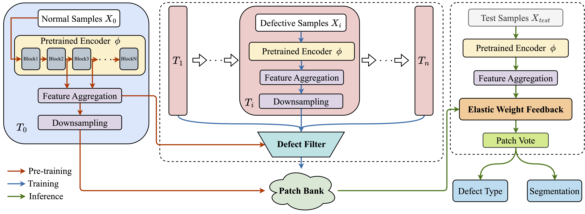

# Building DynamicPatch Bank via Defect Filter for Online Few-shot Defect Detection

## Installation
### Step 1
Create a new virtual environment for Python 3.7. For example:
```bash
conda create -n dpbdf python=3.7
conda activate dpbdf
```
### Step 2
Install required libraries. Here is the list:
```
click==8.1.3
tqdm==4.64.0
faiss-gpu==1.7.2
pillow==9.1.1
numpy==1.21.6
torch==1.11.0
torchvision==0.12.0
scikit-learn==1.0.2
pandas==1.2.4
```
You can use the following command to quickly install required libraries:
```bash
pip install -r requirements.txt
```
## Dataset
For reproducing results in the paper, please Download [MVTec AD dataset](https://www.mvtec.com/company/research/datasets/mvtec-ad/) first, and the structure of the data directory should be organized as following:
```
data
└── mvtec
    ├── tile
    │   ├── train
    │   │   ├── crack  
    │   │   │   ├── 000.png
    │   │   │   ├── 001.png
    │   │   │   └── ...
    │   │   ├── good
    │   │   └── ...
    │   └── test
    │       ├── crack
    │       ├── good
    │       └── ...
    ├── leather
    ├── hazelnut
    └── ...
```
Please refer to data/[dataset]_split.txt and reorganize the dataset for reproducing the results in the paper.
## Quick Start
### Train Example
```bash
./scripts/run_dpbdf.sh mvtec/tile train
```
### Evaluate Example
```bash
./scripts/run_dpbdf.sh mvtec/tile test
```
